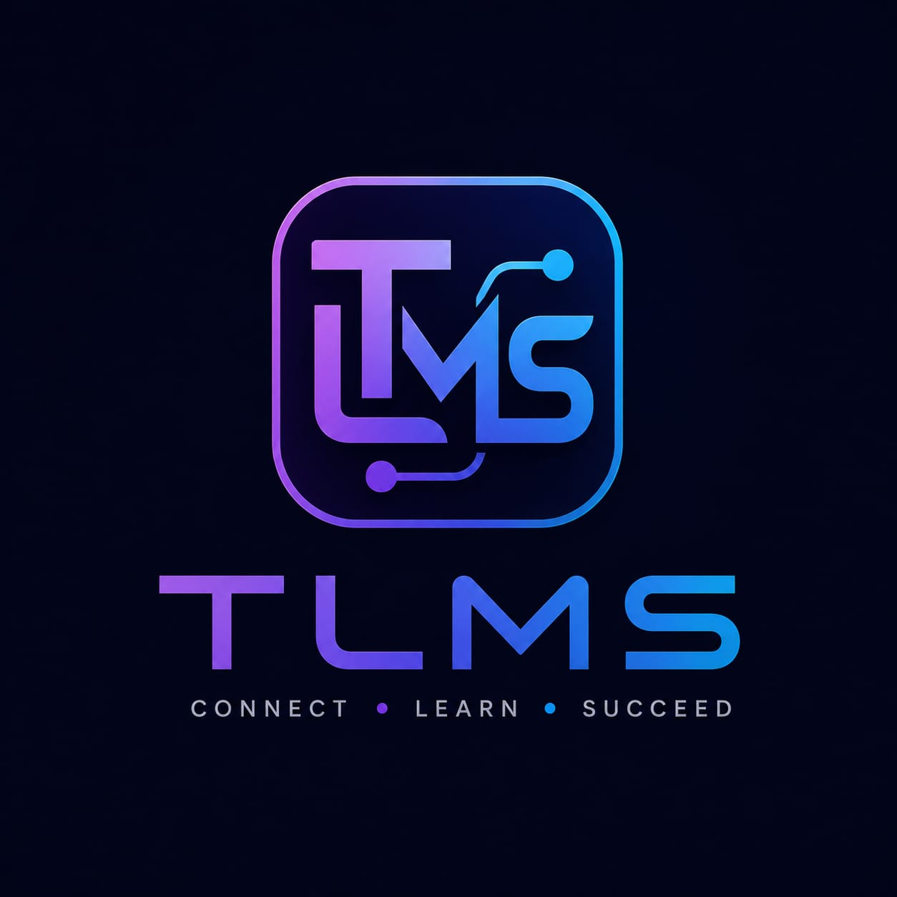

<div align="center">



# TLMS Frontend

**Tuition Locate & Management Service**

*Connect · Learn · Succeed*

[](https://react.dev)
[](https://vitejs.dev)
[](https://motion.dev)
[](https://instigo5483.github.io/tlms-frontend)

[Live Site](https://instigo5483.github.io/tlms-frontend) · [Backend Repo](https://github.com/Instigo5483/tlms-backend) · [Report Bug](https://github.com/Instigo5483/tlms-frontend/issues)

</div>

---

## What is TLMS?

TLMS is a full-stack SaaS platform that connects students with verified tutors and tuition centers. Students can discover educators by subject, grade, and location, send connection requests, pay monthly fees, and track their learning journey — all in one place.

---

## Features

- **Discover** — Find tutors and centers with GPS auto-detection and dynamic filters
- **Connect** — Send and manage enrollment requests with real-time status
- **Pay** — Razorpay-powered monthly fee billing with invoices
- **Dashboards** — Role-specific dashboards for students, tutors, and centers
- **Wallet** — Earnings wallet for tutors/centers with withdrawal system
- **Animations** — Bold Motion animations throughout

---

## Tech Stack

| Layer | Technology |
|-------|-----------|
| Framework | React 19 + Vite 8 |
| Routing | React Router v7 |
| Animations | Motion (Framer Motion v12) |
| Payments | Razorpay Checkout |
| Auth | JWT (email + password) |
| Deployment | GitHub Pages |

---

## Project Structure

```
src/
├── components/
│   └── Navbar.jsx          # Fixed pill navbar with logo
├── context/
│   └── AuthContext.jsx     # JWT auth state
├── hooks/
│   └── useAuth.js          # Auth hook
├── pages/
│   ├── Landing.jsx         # Hero + features + CTA
│   ├── Login.jsx           # Sign in / Sign up
│   ├── Discover.jsx        # Tutor discovery with filters
│   ├── Profile.jsx         # Tutor / center profile
│   ├── StudentDashboard.jsx
│   ├── TutorDashboard.jsx
│   ├── CenterDashboard.jsx
│   ├── Payments.jsx        # Monthly bills + Razorpay
│   └── Wallet.jsx          # Earnings + withdrawals
├── App.jsx                 # Routes
├── main.jsx                # Entry point
└── index.css               # Global design system
```

---

## Getting Started

### Prerequisites

- Node.js 18+
- Backend running (see [tlms-backend](https://github.com/Instigo5483/tlms-backend))

### Installation

```bash
# Clone the repo
git clone https://github.com/Instigo5483/tlms-frontend.git
cd tlms-frontend

# Install dependencies
npm install
```

### Environment Variables

Create `.env.development`:

```env
VITE_BACKEND_URL=http://localhost:3001
VITE_RAZORPAY_KEY_ID=rzp_test_your_key_here
```

Create `.env.production`:

```env
VITE_BACKEND_URL=https://your-backend.up.railway.app
VITE_RAZORPAY_KEY_ID=rzp_test_your_key_here
```

### Running Locally

```bash
npm run dev
```

Open [http://localhost:5173/tlms-frontend](http://localhost:5173/tlms-frontend)

---

## Deployment

This project deploys to GitHub Pages via `gh-pages`.

```bash
npm run deploy
```

This runs `vite build` then publishes the `dist` folder to the `gh-pages` branch.

---

## User Roles

| Role | Capabilities |
|------|-------------|
| **Student** | Discover tutors, send requests, pay monthly fees, view bills |
| **Tutor** | Accept/decline requests, set monthly fees, manage students, withdraw earnings |
| **Center** | Same as tutor with center-specific profile fields |

---

## Design System

- **Background:** `#050508` with ambient purple/cyan blobs
- **Accent colors:** Purple `#a855f7`, Cyan `#06b6d4`, Pink `#ec4899`, Green `#10b981`
- **Typography:** Inter, weight 400–900
- **Animations:** Motion spring physics, `ease: [0.22, 1, 0.36, 1]`
- **Cards:** Glassmorphism with colored gradient borders per role

---

## Backend

The backend is a separate Express.js + PostgreSQL service hosted on Railway.

→ [tlms-backend](https://github.com/Instigo5483/tlms-backend)

---

## License

MIT © 2026 TLMS
